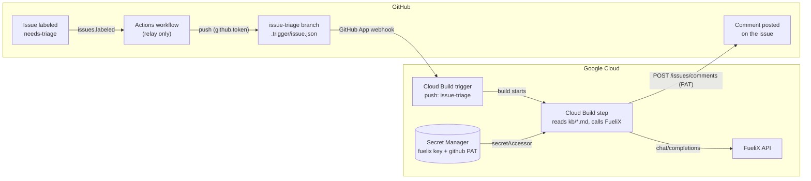

# Issue Triage Relay

How a labeled GitHub issue gets a FueliX-backed recommendation posted back as a
comment, without a single GCP credential ever touching GitHub Actions.

Infra for this lives in `infra-cloudrun/modules/issue-triage-agent` (see that
module's README for the Terraform side); this doc covers the design and the
code in this repo.

## Why this shape

The obvious design — GitHub Actions calls a private Cloud Run service
directly — doesn't work in this org. There are only two ways for GitHub
Actions to hold a real Google identity: Workload Identity Federation, or a
static service account key. `iam.workloadIdentityPools.create` is denied by
org policy, and static keys aren't to be created either. So Actions never
authenticates to GCP at all.

Instead, the design reuses the one bridge this org already trusts: Cloud
Build's GitHub App connection — the same push-triggered mechanism that
already runs every other pipeline in `infra-cloudrun`. GitHub Actions only
ever pushes a plain commit using its own ambient token. Cloud Build, already
a first-class GCP identity, does everything that needs GCP access.

## The relay

The only two edges that carry write authority across the GitHub↔GCP boundary
are `push (github.token)` and `POST /issues/comments (PAT)` — everything else
is either read-only or pre-existing infrastructure (the GitHub App
connection). No new GitHub-to-GCP trust was created for this feature.

## Walking the hops

1. **Issue labeled `needs-triage`.** Anyone labels an issue on this repo.
   This is the only human action in the loop.
2. **Actions workflow relays, nothing more.** On `issues: labeled`
   ([`.github/workflows/issue-triage.yml`](.github/workflows/issue-triage.yml)),
   the workflow writes one JSON file — issue number, title, body — to a
   fixed path. No GCP SDK, no auth step, no secrets. It holds only its own
   ambient `github.token`.
3. **Trigger file lands on `issue-triage`.** A single fixed path,
   `.trigger/issue.json`, gets overwritten each run. Cloud Build checks out
   the exact commit SHA of its own trigger, so a later overwrite can't race
   an in-flight build.
4. **Cloud Build trigger fires.** The push hits a trigger watching that one
   branch — the same GitHub App connection every other pipeline in this repo
   already uses.
5. **Cloud Build does the actual work**
   ([`cloudbuild-issue-triage.yaml`](cloudbuild-issue-triage.yaml) →
   [`scripts/issue_triage.py`](scripts/issue_triage.py)). Running as its own
   trusted GCP identity, the build step reads [`kb/*.md`](kb) straight from
   its own checkout (no GitHub API call needed for that), pulls the FueliX
   key and a GitHub PAT from Secret Manager, and asks FueliX for a
   recommendation grounded in those articles.
6. **Comment lands back on the issue.** The same build step posts the
   recommendation directly via GitHub's REST API, using the PAT it just
   read — the one credential in this whole design that has to exist, held
   in the org's own secret store rather than as a GCP key sitting in GitHub.

## Decisions worth remembering

| Decision | Why |
|---|---|
| No Workload Identity Federation | `iam.workloadIdentityPools.create` is denied by org policy. Confirmed by testing, not assumed — rules out the standard keyless GitHub-to-GCP pattern entirely. |
| No static service account keys | Ruled out on request, independent of the org-policy question. Combined with WIF being blocked, GitHub Actions has no path to a real GCP identity at all. |
| Cloud Run was the wrong shape | An earlier design hosted the agent as a private Cloud Run service. Dropped because inviting it meant resource-level IAM grants (`run.services.setIamPolicy`) this org's default roles don't include — a fixable permission gap, but unnecessary complexity once the trigger moved to Cloud Build. |
| Editor role ≠ resource-level IAM admin | `roles/editor` + `roles/resourcemanager.projectIamAdmin` covers project-level bindings but not `setIamPolicy` on individual Cloud Run services or Secret Manager secrets. Each new secret's access grant needs a one-time bootstrap via an account holding `run.admin` / `secretmanager.admin`, then a `terraform import` so Cloud Build never needs to touch that policy again. |
| One GitHub PAT, narrowly scoped | Fine-grained, this repo only, Issues: read/write — no Contents access, since Cloud Build already has the repo via its own connection. The one unavoidable external credential in the whole design. |
| Single fixed trigger file path | `.trigger/issue.json` is overwritten every run rather than named per-issue. Safe because Cloud Build always checks out the exact commit SHA of the push that triggered it, not a moving branch tip. |

## Current status

- [x] Infra applied — Cloud Build trigger, both Secret Manager containers, IAM bindings
- [x] Relay code merged to `main` — workflow, `cloudbuild-issue-triage.yaml`, `scripts/`, `kb/`
- [x] `needs-triage` label created on this repo
- [x] Real FueliX key added to `issue-triage-agent-fuelix-api-key`
- [x] GitHub PAT added to `issue-triage-agent-github-token`
- [x] First end-to-end test: label an issue, watch the comment land — confirmed on [issue #1](https://github.com/raffy-telusgit/hello-world-app/issues/1), correctly grounded in `database-connection-timeout.md`

## Reference

- GCP project: `raffy-cicd-lab-bf9b4f`, region `northamerica-northeast1`
- Terraform module: `infra-cloudrun/modules/issue-triage-agent`
- Secrets: `issue-triage-agent-fuelix-api-key`, `issue-triage-agent-github-token`
